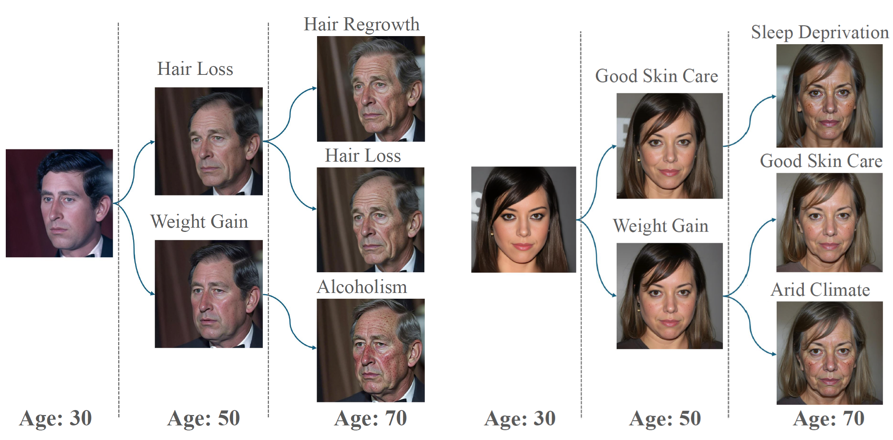
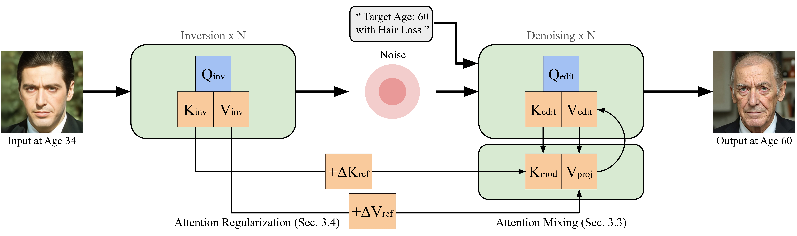

<div align="center">
<div style="text-align: center;">
    <h2>The Aging Multiverse: Generating Condition-Aware Facial Aging Tree via Training-Free Diffusion</h2>
</div>


<div>
    <span class="author-block">
        <a href="https://www.linkedin.com/in/bang-gong-461862250/">Bang Gong</a><sup>1*</sup>,</span>
    <span class="author-block">
        <a href="https://luchaoqi.com/">Luchao Qi</a><sup>1*</sup>,</span>
    <span class="author-block">
        <a href="https://scholar.google.com/citations?user=g2CuYi4AAAAJ&hl=en">Jiaye Wu</a><sup>2</sup>,</span>
    <span class="author-block">
        <a href="https://www.linkedin.com/in/zhicheng-fu-97533492/">Zhicheng Fu</a><sup>3</sup>,</span>
    <span class="author-block">
        <a href="https://www.linkedin.com/in/chunbo-s-24064661/">Chunbo Song</a><sup>3</sup>,</span>
    <span class="author-block">
        <a href="https://www.cs.umd.edu/~djacobs/">David W. Jacobs</a><sup>2</sup>,
    </span>
    <span class="author-block">
        <a href="https://www.linkedin.com/in/john-nicholson-9684792/">John Nicholson</a><sup>3</sup>,
    </span>
    <span class="author-block">
        <a href="https://www.cs.unc.edu/~ronisen/">Roni Sengupta</a><sup>1</sup>,
    </span>
</div>
<div class="is-size-5 publication-authors">
<span class="author-block"><sup>1</sup>UNC Chapel Hill</span>
<span class="author-block"><sup>2</sup>University of Maryland</span>
<span class="author-block"><sup>3</sup>Lenovo</span>
</div>

*\* Equal Contribution*

<div>
    <h4 align="center">
        <a href="https://agingmultiverse.github.io/" target='_blank'>
        
        </a>
        <a href="https://arxiv.org/abs/2506.21008" target='_blank'>
        
        </a>
    </h4>
</div>

<strong>Aging is not a single path but a multiverse of possibilities shaped by our choices and environments. Aging Multiverse brings this idea to life by generating branching visualizations—"aging trees"—that show how you might age under different lifestyle conditions. </strong>

<div style="width: 100%; text-align: center; margin:auto;">
    
</div>

For more visual results, go checkout our <a href="https://agingmultiverse.github.io/" target="_blank">project page</a>

---
</div>

## ⭐ Update
- [2025.10] Code release.
- [2025.08] Paper accepted to SIGGRAPH Asia 2025.


## 🎃 Overview



## ⚙️ Setup

### Environment
1. Clone Repo
    ```bash
    git clone git@github.com:gongbang02/agingmultiverse.git
    cd agingmultiverse
    ```

2. Create Conda Environment
    ```bash
    conda env create -f environment.yml
    ```


### Preprocessing

We preprocess input images for stable performance:

1. **Image Enhancement**  
   We follow [GFPGAN](https://github.com/TencentARC/GFPGAN) to enhance face quality. 

3. **Face alignment**  
   We use `dlib` to align faces, you can use script [here](https://github.com/luchaoqi/align_face) for multi-processing.


## 🔄 Aging Direction Extraction

To pre-compute the attention feature aging direction for our proposed Simulated Aging Regularization, put the young and old image clusters of target identity under a directory structured as follows:


```
{path_to_image_clusters}
├── {age}_{idx}.ext
```

To extract the per-image attention features for aging direction calculation, run:

```python
python src/attention_inversion.py \
--source_img_dir {path_to_image_clusters} \
--gender {gender_of_target_identity} \
--ethnicity {ethnicity_of_target_identity} \
--age_filter_young {young_lower_bound} {young_upper_bound} \
--age_filter_old {old_lower_bound} {old_upper_bound} \
--save_feature \
--feature_path {path_to_store_attention_features}
```

Next, calculate the young average features and old average features and obtain the attention feature aging direction:

```python
python src/attention_direction.py \
--base_path {feature_path_from_last_step} \
--output_dir_averages {path_to_store_group_average_features} \
--output_dir_direction {path_to_store_aging_direction}
```


## ⚡ Image Editing

After obtaining the aging direction, run image editing with:

```python
python src/edit.py \
--source_prompt "A photo of {ethnicity} {gender} at {input_age} years old." \
--target_prompt {llm_refined_target_prompt} \
--target_age {target_age} \
--input_age {input_age} \
--guidance 2 \
--source_img_dir {path_to_input_images} \
--num_steps 15 \
--inject 3 \
--name 'flux-dev' \
--offload \
--output_dir {path_to_edited_images} \
--direction_path {path_to_aging_direction}
```

Prompt enhancement is not built-in in our code, we recommend users take our meta prompt in ```meta_prompt.txt``` for prompt enhancement with any LLM of their choice.

## ❤️ Acknowledgements
We thank [FLUX](https://github.com/black-forest-labs/flux/tree/main) and [RF-Solver-Edit](https://github.com/wangjiangshan0725/RF-Solver-Edit/tree/main) for their clean codebase.

## 📑 Citation
If you find our repo useful for your research, please consider citing our paper:

```bibtex
@misc{gong2025agingmultiversegeneratingconditionaware,
      title={The Aging Multiverse: Generating Condition-Aware Facial Aging Tree via Training-Free Diffusion}, 
      author={Bang Gong and Luchao Qi and Jiaye Wu and Zhicheng Fu and Chunbo Song and David W. Jacobs and John Nicholson and Roni Sengupta},
      year={2025},
      eprint={2506.21008},
      archivePrefix={arXiv},
      primaryClass={cs.CV},
      url={https://arxiv.org/abs/2506.21008}, 
    }
```

Shield: [![CC BY-NC-SA 4.0][cc-by-nc-sa-shield]][cc-by-nc-sa]

This work is licensed under a
[Creative Commons Attribution-NonCommercial-ShareAlike 4.0 International License][cc-by-nc-sa].

[![CC BY-NC-SA 4.0][cc-by-nc-sa-image]][cc-by-nc-sa]

[cc-by-nc-sa]: http://creativecommons.org/licenses/by-nc-sa/4.0/
[cc-by-nc-sa-image]: https://licensebuttons.net/l/by-nc-sa/4.0/88x31.png
[cc-by-nc-sa-shield]: https://img.shields.io/badge/License-CC%20BY--NC--SA%204.0-lightgrey.svg